 &nbsp;&nbsp;&nbsp;&nbsp;&nbsp;&nbsp;&nbsp;&nbsp;&nbsp;&nbsp;&nbsp;&nbsp;&nbsp;&nbsp;&nbsp;&nbsp;&nbsp;&nbsp;&nbsp;&nbsp;&nbsp;&nbsp;&nbsp;&nbsp;&nbsp;&nbsp;&nbsp;&nbsp;&nbsp;&nbsp;&nbsp;&nbsp;&nbsp;&nbsp;&nbsp;&nbsp;&nbsp;&nbsp;&nbsp;&nbsp;&nbsp;&nbsp;&nbsp;&nbsp;&nbsp;&nbsp;&nbsp;&nbsp;&nbsp;&nbsp;&nbsp;&nbsp;&nbsp;&nbsp;&nbsp;&nbsp;&nbsp;

<br>
# 3D visualization of geospatial data using Blender
This is material for the summer geospatial studio held at Center for Geospatial Analytics, in Raleigh, NC, 2 August, 2017.

Prepared by : [Payam Tabrizian](https://github.com/ptabriz) <br>
Presented with: [Anna Petrasova](https://github.com/petrasovaa/), [Vaclav Petras](https://github.com/wenzeslaus), and [Helena Mitasova](https://github.com/hmitaso?tab=stars)<br>
Tested and reviewed by: [Garrett Millar](https://github.com/gcmillar)
___________________
## Contents

### Abstract
### Part 1. Basics of Blender interface and functionalities
[I. Intro](#i-what-is-blender-and-why-using-Blender?)<br>
[II. Basic components of blender interface](#ii-basic-components-of-the-blender-interface)<br>
[III. Editors](#iii-editors)<br>

### Part 2. Processing, shading and rendering geospatial data
[I. Setting up the scene](#i-setting-up-the-scene)<br>
[II. Georeferencing the blender Scene](#ii-georeferencing-the-blender-scene)<br>
[III. Importing digital surface model](#iii-importing-digital-surface-model)<br>
[IV. Importing viewpoint shapefile](#iv-importing-viewpoint-shapefile)<br>
[V. Shading the scene](#v-shading-the-scene)<br>
[VI. 3D modelling made easy: scripting procedure](#vi-modelling-made-easy)

___________________
## Abstract

What if your geospatial data and simulations like flooding, fire-spread and viewshed are converted to realistic, interactive and immersive 3D worlds, without the need to deal with overly complicated or proprietary 3D modelling software ? In this hands-on workshop we will explore how to import and process various types of geospatial data (e.g., rasters, vectors) using Blender, an open-source 3D modelling and game engine software. We will start with a brief and focused introduction into Blender graphical user interface (GUI), Python API, as well as the GIS addon. Once we import our GIS data into Blender, we will go over the techniques (both with GUI and command line) to increase the realism of our 3D world through applying textures, shading, and lighting.

___________________
## I. What is Blender and why using Blender?
Blender is an open-source 3D modelling, rendering and game engine software. You can create photorealistic scenes and life-like animations with it. The feature that makes Blender highly suitable for geospatial visualization is its capability to import various georeferenced data thanks to [BlenderGIS addon](https://github.com/domlysz/BlenderGIS). Almost every operation done in the blender interface, can be scripted in the Python scripting environment, allowing you to automate or batch process your 3D modelling workflow. Moreover, using [Blender4web](https://www.blend4web.com/en/) or [sketchfab](https://sketchfab.com/exporters/blender) addons, you can would be able to publish your geospatial models online, so that everyone can interactively explore or download your work. <br>

[Learn more about Sketchfab]()<br>
[A sample geospatial model in Sketchfab](https://sketchfab.com/models/298dfaf54e4447459275493e7b2adf96)<br>


## II. Basic components of the Blender interface


Blender has numerous components and features that, thanks to it open-source capabilities, are growing every day. Covering all aspects of the software itself require several lessons. The purpose of this section is to provide a brief introduction to Blender's graphical user interface and some of its features that are essential for working with geospatial data, and will be used throughout this tutorial. We will specifically introduce the following components: __Areas, Editors, Tabs, Headers, Panels__

* Browse the workshop data folder, locate and open *interface_introduction.blend*

|Blender interface|
|:---:|

Blender's application window can be flexibly arranged and divided up into a number of __Areas__. An area contains the workspace for a particular type of editor, like a *3D View Editor*, or an *Outliner*.  In figure above you can see the application window is divided into five areas, each assigned to an editor.  

__Editors__ are responsible for displaying and modifying different aspects of data. Imagine editors as full-fledge software specialized for a specific tasks, like changing data properties, image editing, video editing, animation design, game design, and etc. You can assign an area to a specific editor using __Editor Type selector__ , the first button at the left side of a header (figure below, left). Every area in Blender may contain any type of editor and it is also possible to open the same type multiple times.

__Tabs__ are overlapping sections in the user-interface. Tabs can be vertical (Tool Shelf) or horizontal (Properties Editor, User Preferences).

Another common feature is the __Header__, that contain menus and commonly used tools specific to each editor. It has a small horizontal strip shape with a lighter gray background, which sits either at the top or bottom of the area.

Finally, the smallest organizational unit in the user interface is a __Panel__. You can usually collapse panels to hide their contents. They are used in the Properties Editor, but also for example in the Tool Shelf and the Properties region. In the image below on the right you can see three panels one of them is expanded and the rest are collapsed.

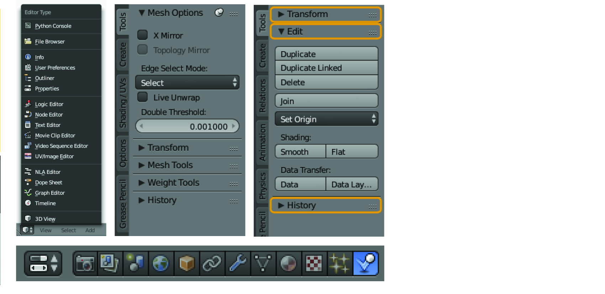 <p> __Above:__ Editor type selector (left), A Toolbar with tabs (middle), Toolbar Panels (right)
__Below:__ A Header with tabs

### III. Editors
Now that you have some general ideas about the interface, in following we will review some of the commonly used editors.

### 3D view
The __3D View__ is the visual interface with the 3D data and scene with numerous functionalities for modeling, animation, texture painting, etc. Unlike the 2D environment of GIS software, where you can only navigate in x and y directions, 3D viewport allows full control over our viewing angle, depth, size, etc. You can press and hold down mouse scroll (or middle click) button to change the viewing angle (or orbiting around), shift and drag to pan, and roll to zoom back and forth.

Now note the panel on the left side of the region which is called __Tool shelf__ and it has a variety of the tools for 3D editing. Newly installed addons also appear in this toolbar. Now notice the bottom __Header__. It includes menus for adding, editing objects as well as viewing and shading options.

| 3D view header (retrieved from Blender manual)|
|:---:|

Header's __View menu__ allow you to select a specific viewpoint such as top, left or different perspectives. Also notice that each of these commands have a keyboard shortcut associated with them. For example you can push `numpad 3` (if you have a full keyboard) to switch to top view.

__Add menu__ provides a list of different types of 2D and 3D object that can be added to a scene

__Interaction mode__ allows you to toggle between the __Object mode__ and __Edit mode__. Edit mode allows you to access more low-level structures of your object, like faces, and vertices. In the examples that we complete in this tutorial, we will use some of these options to refine the surface model. It is important to get familiar with the 3 core elements, __Faces__, __Edges__ and __Vertex__. You can select these elements by clicking on their corresponding icons.

On the right side of the interaction mode, is the viewport __Shading mode__ which you can use to choose the visualization and viewport rendering method. Default is the __Solid mode__ that shows objects with solid faces, but without textures and shading. The __Material mode__ shows the object with textures and is suitable for having an idea how 3D objects may look like with materials. The __Rendering mode__, enables real-time rendering, which computes the near-to-final product on-the-fly as you interact with the object.

#### Basic object selection and interaction

__Objects__ are basically everything that you see in the 3D view. They include 3D objects, lights and cameras. You can select any object in the scene using the mouse right-click. Selected objects are highlighted in orange so you can easily distinguish them. Use the 3 axes (i.e., handles) to move the object in your preferred direction. To select multiple objects, press and hold `control` key and right click on objects to add to your selection. You can rotate objects by pressing `R` keyboard button, or scale objects using `S` key. Note that when you are transforming an object, a numeric output on the left bottom of the 3D viewport will give you more precise feedback on how much you moved, rotated or scaled an object. You can delete the object by selecting it, pressing `delete` key and selecting ok.

[Learn more about 3D view](https://docs.blender.org/manual/en/dev/editors/3dview/introduction.html#tool-shelf)
___________________
### Outliner
As its name suggests, outliner lists and organizes the scene objects. From there you can set the hierarchy, visibility of the 3D objects or lock them if you need. You can also select and activate objects by clicking on their name in the list. Figure below shows **Outliner editor** that list three objects (Camera, Cube and Lamp). The Lamp object is selected.

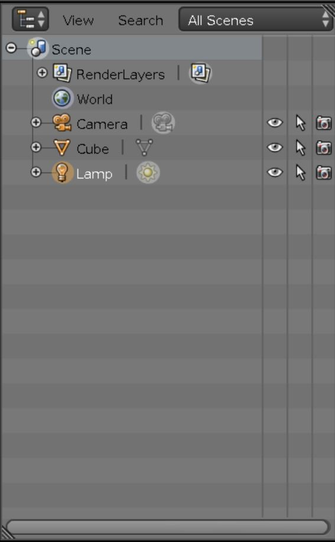 <br>
___________________
### Python console
The Python console is a very useful editor for testing and executing short commands, which can then integrated in larger workflows. The Blender modelling and gaming modules are already loaded in python console so you can you can test your code snippets without extra effort of calling the modules.

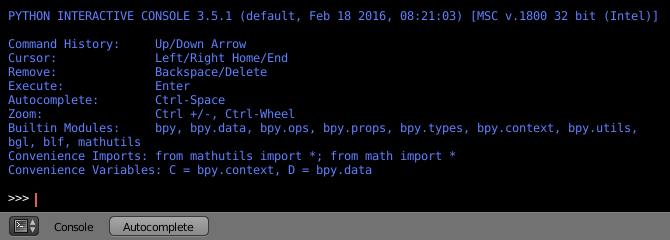 <br> Python console (retrieved from Blender manual)|
|:---:|

__`Example 1.`__ Simple object operation using python console.

* Call *Cube* object and print its location  
  * Copy and paste the individual command lines in the console and press enter  

```python
cubeObj = bpy.data.objects[“cube”]
print (cubeObj.location)
```
* Move cube object to location *x = 0 , y = 2 , z = 3*
```python
cubeObj.location = (0, 2, 3)
```
* Move cube object 5 units in positive X direction
```python
cubeObj.location [0] += 5
```
* Select and delete cube object
``` python
cubeObj.select = True
bpy.ops.object.delete()
```

* Adding a simple object (Blender's default Monkey object) with radius 2 ,and location (0,0,0)

``` python
bpy.ops.mesh.primitive_cube_add(radius=2, location = (0,0,0))
```
___________________
### Text Editor
Text editor allows you to edit your python script and run it inside Blender.
By pressing the __+__ icon you can start a new file and click on __Run Script__ to execute your code. You need to call modelling and gaming modules in text editor.

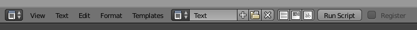 <br> Text Editor|
|:---:|

 __`Example 2.`__  Batch processing simple object operations using text editor

* Create a matrix of 20 by 20 Cubes with varied size and location.
  * In the text editor click on the __+__ icon to create a new textfile
  * Copy and paste the snippet below and click on __Run script__ button
  * The results should look like the figure below

``` python
import bpy

for x in range(20):
    for y in range(20):  
        bpy.ops.mesh.primitive_cube_add(radius = .1 + (x*y*.0005), location=(x, y, (x*y*.02)))
```

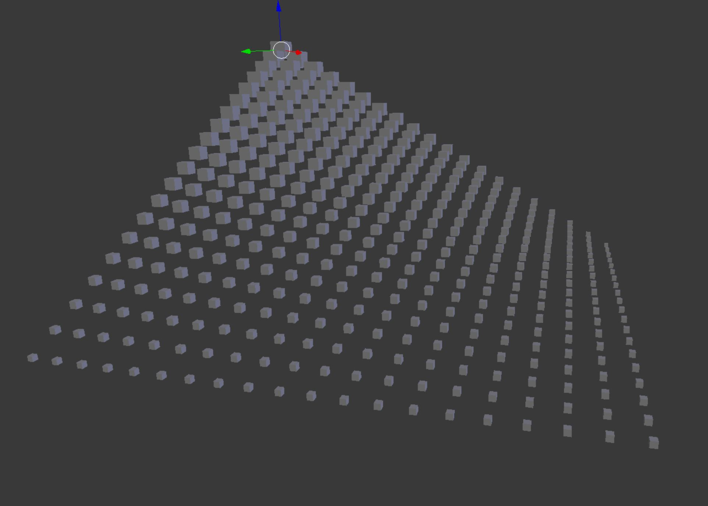 <br> Cube matrix|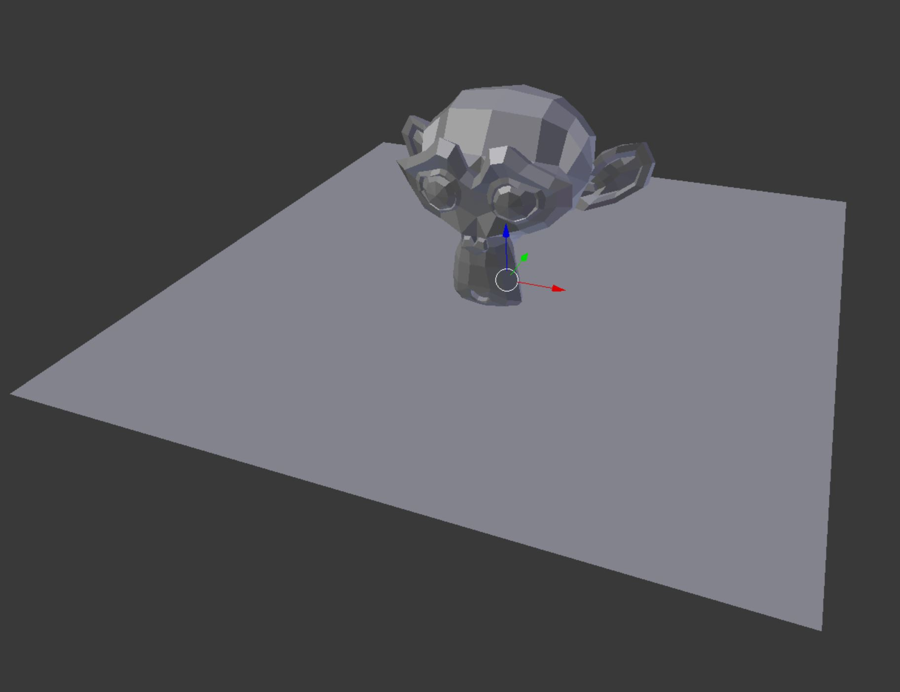 <br> Monkey and plane
|:---:|:---:|

* Delete all cube objects, add a *Monkey* object, and add a *Plane* object
  * Open a new text window or delete the contents of existing ones

``` python
import bpy

for object in bpy.data.objects:
    if "Cube" in object.name:
        object.select = True
        bpy.ops.object.delete()     

bpy.ops.mesh.primitive_monkey_add(location=(0, 0, 0), radius = 3)
bpy.ops.mesh.primitive_plane_add(location=(0, 0, -3), radius = 10)
```

___________________
### Properties editor

__Properties editor__ allows you to modify the properties of the scene, rendering setting, transforming objects or changing their material or texture properties. The components that we will work with in the following examples are *Object, Material and Texture properties*.


|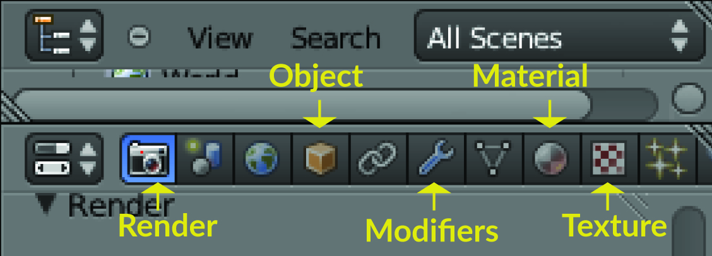 Properties panel|
|:---:|

Note: Properties editor's interface is dynamically changing according to the selected object. For example, if you select the light, the little sun icon will appear to set the light properties and similarly you should select camera to be able to see the camera tab and modify the properties.

__Object properties__ tab allows you to transform the location, orientation and scale of the object, along with their display properties. You can use numeric input for transformation parameters.

__`Example 3.`__ Basic object transformation using properties modifier

* Make sure that *Suzanne* object is selected. It should be highlighted in __outliner__  
* Go to __Properties editor__ > __Object tab__ > expand the __Transform__ panel
* Type *3, 2, 4* for *X, Y, Z* parameters, respectively.
* Change *Rotation* and *Scale* parameters to see how they affect the object


__Materials__ tab allows you to assign or change an object’s material. You can add and remove material, or use material browser to assign previously created materials to the object. In this tutorial we briefly introduce two basic components of Materials, __Shaders__ and __Textures__.  

**Shading** (or coloring) allows you to adjust the base color (as modified by the diffusion and specular reflection phenomenon) and the light intensity.
You can also assign __Texture__ to the materials. You can either select from preset textures already available in scene, or load a new one from hard drive. Lets practice shading and texturing in the following example.

__`Example 4.`__ Assigning simple Shaders and Textures

* Shaders
  * From outlier select object make sure that *Suzanne* object is selected
  * Go to __properties editor__ > __object tab__ > click on the __+ New__ button to create a new material
  * Double click on the material name (e.g., *Material.001*) and change it to *Mymat*
  * Expand the preview panel to see a live preview of the material as you are changing it
  * Change the color parameter to red
  * Go to 3D editor bottom __Header__ > __Viewport shading__ > __rendered__ to see the object render in realtime
  * Change the color to yellow
  * Click on the __Diffuse BSDF__ field in front of the surface parameter and select *Glass BSDF*
  * Now try  *Emission BSDF* and *Glossy BSDF* shaders while the viewport shader is on *Rendered* mode to see the effect on rendering. Your material preview and scene rendering should look like the figure shown below

|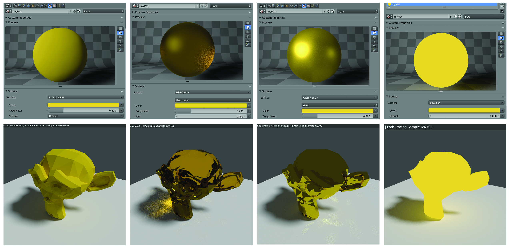 Diffuse BSDF &emsp;&emsp;&emsp;&emsp;&emsp;&emsp;&emsp;&emsp;&emsp;&emsp;&emsp;  Glass BSDF &emsp;&emsp;&emsp;&emsp;&emsp;&emsp;&emsp;&emsp;&emsp;&emsp;&emsp;&emsp;&emsp;&emsp;&emsp; Glossy BSDF &emsp;&emsp;&emsp;&emsp;&emsp;&emsp;&emsp;&emsp;&emsp;&emsp;&emsp;&emsp;&emsp;&emsp;&emsp;Emission|
|:---:|

* Textures
  * While the shader is still on “Glossy BSDF”, click on the radio button in front of the “Color” parameter. A widget with several columns will appear. From the texture column, select “Voronoi” to see how texture impact the rendering.
  * Now try “Gradient” texture. Your material preview and scene rendering should look like the left two columns in the figure below.

|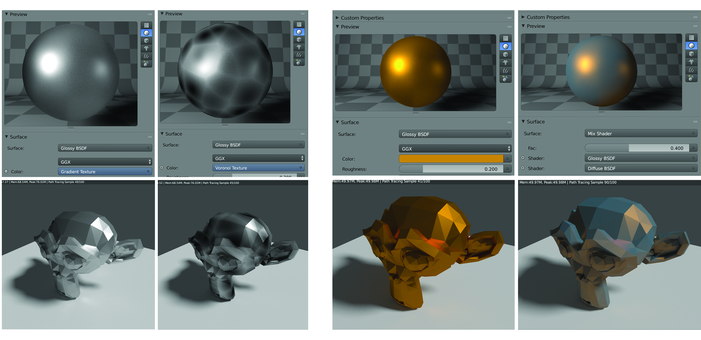 Gradient texture &emsp;&emsp;&emsp;&emsp;&emsp;&emsp;&emsp;&emsp;&emsp;&emsp;&emsp;  Voronoi texture &emsp;&emsp;&emsp;&emsp;&emsp;&emsp;&emsp;&emsp;&emsp;&emsp;&emsp;&emsp;&emsp;&emsp;&emsp; Diffuse Shader &emsp;&emsp;&emsp;&emsp;&emsp;&emsp;&emsp;&emsp;&emsp;&emsp;&emsp;&emsp;&emsp;&emsp;&emsp; Mix Shader|
|:---:|

___________________
### Node Editor (material)
In addition to creating materials as just described using all the settings on all the materials panels, in Blender you can create more sophisticated materials by routing basic materials through a set of nodes. Each node performs some operation on the material, changing how it will appear when applied to the mesh, and passes it on to the next node. In this way, very complex material appearances can be achieved.

__`Example 5.`__ Setup a Mix Shader using node editor.
In this example we mix a glossy shader with a diffuse shader to make a composite material.

* Right click on the Monkey object (*Suzanne*) to select it
* Switch the python console editor (bottom left area) to __Node editor__ (figure below, left).
* In the node editor You will see the nodes we have already setup. The Glossy node shader’s output is connected to the surface input of the Material output.  
We will now add two other shaders, a diffuse shader, and a mix shader.
* From the Noder Editor’s bottom Header > __Add__ > __Shader__ > __Diffuse BSDF__
* From the Noder Editor’s bottom Header >__Add__ > __Shader__ > __Mix shader__. You should be able to see both nodes have been added in to your node editor.
* Change the color value of the Diffuse node to *R: 0.075 G: 0.35 B: 0.50*
* Disconnect the __Glossy BSDF__ input from the surface
* Connect BSDF output of both Diffuse and Glossy shaders to the inputs on the left side of the Mix (Shader)
* Connect Shader output (on the right side) to the Surface input of the Material output nodes (figure below, right).
* With the Fac parameter, you can adjust the mixture level.
* Your material should look like the right column of the above figure
[learn more about nodes](https://docs.blender.org/manual/de/dev/render/cycles/nodes/index.html)

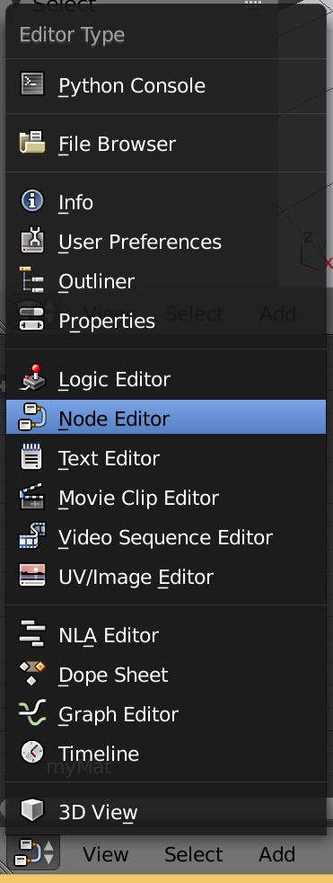|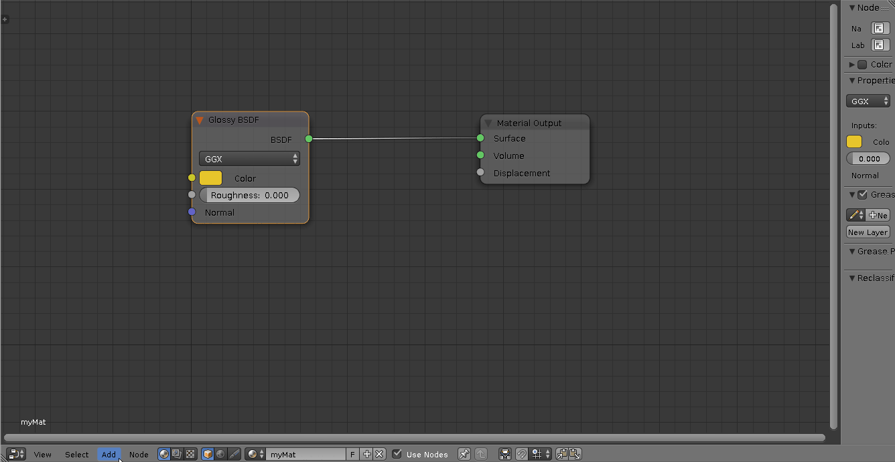 Node design with mix shader|
|:---:|:---:|

Other Complementary resources for learning blender interface

[Blender manual](https://docs.blender.org/manual/en/dev/interface/index.html)
[CG cookie](https://www.google.com/search?q=introduction+to+blender+interface&oq=introduction+to+blender+interface&aqs=chrome..69i57.5976j0j1&sourceid=chrome&ie=UTF)
[learn more about editors](https://docs.blender.org/manual/en/dev/editors/)
----------
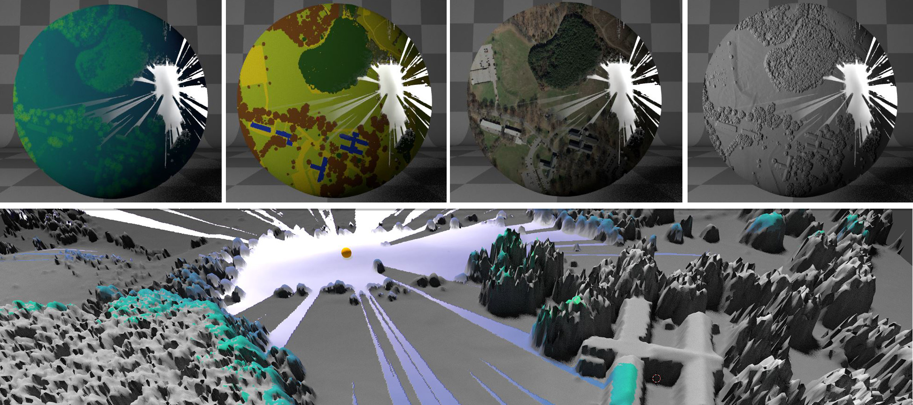

## Part 2. Processing, shading and rendering geospatial data

In this section we will learn how to setup blender GIS addon, georeferences and importing raster and vector data and assigning simulations and orthophoto maps as textures. We will proceed with the instructions using a simple viewshed assignment. The aim is to visualize and compare viewsheds simulation computed for 4 different locations across a site. The general workflow is as following.

I) Preparing the scene and lighting
II) Georeferencing the scene
III) Importing and processing the digital surface raster
IV) Importing and processing the viewpoint shapefile
V) Draping the viewshed map and orthophoto on the surface model

*Note:* Viewshed is a raster map showing a surface's visible areas from a given locations.  

There are two ways to complete the example; Scripting method (using blender's Python editor) and GUI (graphical user interface) method. For each step, the GUI procedure is listed as bullet points. Below that you can find the code snippet if you would like to follow the Scripting procedure. To execute the code snippet open a new text file in __Text Editor__ and for each step directly copy-paste the code snippet into the editor and click on __Run Script__ to execute the code.

|Method| Duration      |  difficulty  |
|------| ------------- | -----:|
|GUI   |1-2 hours      | Complex  |
|Python editor    | 10-15 minutes  |Easy|

*Note* For better learning complete the example with both methods but do not mix and match. Try to follow one method from the beginning to the end.

### I. Setting up the scene
__`GUI`__
* Run Blender and open the file "Example_A.blend".
* Select the default __Cube__ object in 3D viewport and delete it (right-click on the object > press delete > ok )
* Set __render engine__ to "Cycles". You can find it in the top header, the default is "Blender Render"
* To increase the _Lamp_ elevation and change the Lamp type to "Sun" for appropriate lighting:
    * Left click on the __Lamp__ object in __Outliner__ to select it
    * Go to __Properties editor__ > __Object__ (the orange cube icon) > __Transform__ panel > in the __Location__ matrix, change the *Z* value to 1000 (see below figure if needed)
* To change lamp type to Sun and increase the emission:
    * In __Properties editor__ > __Lamp__ (two icons to the right of the __Object__ icon) > expand the __Lamp__ panel > Change lamp type to *Sun*
    * Expand the __Nodes__ panel > Click on __Use Nodes__ to enable modifying Sun parameters.
    * Set the __Strength__ parameter to 6.00

__`Python editor`__
```python
import bpy
# remove the cube
cube = bpy.data.objects["Cube"]
cube.select = True
bpy.ops.object.delete()

# change lamp type and elevation
import bpy
lamp = bpy.data.lamps["Lamp"]
lamp.type = "SUN"
lampObj = bpy.data.objects["Lamp"]
lampObj.location[2] = 1000

# Setup node editor for lamp and increase the lamp power
lamp.use_nodes = True
lamp.node_tree.nodes["Emission"].inputs[1].default_value = 6

# Set render engine to cycles
bpy.context.scene.render.engine = 'CYCLES'
```

|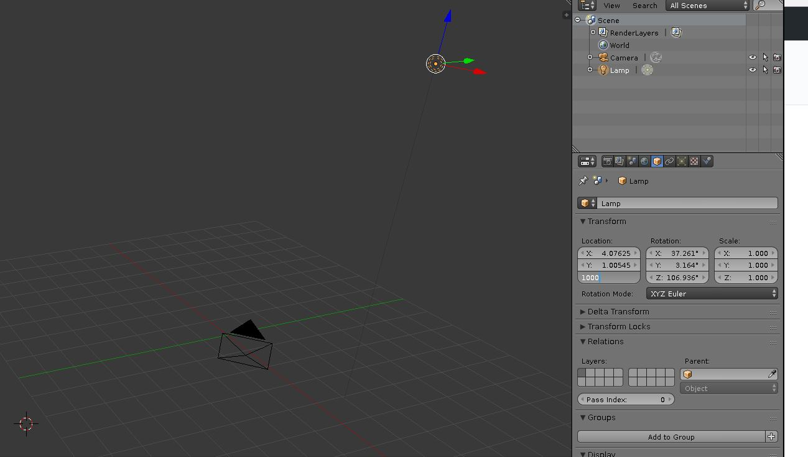 Changing the lamp elevation|
|:---:|

### II. Georeferencing the Blender Scene

#### Setting up Blender GIS addon
* [Download](https://github.com/ptabriz/BlenderGIS) the BlenderGIS addon
* Go to __file__ >  __user preferences__ ( `Alt + Ctrl + U` ) > __Add-ons__ > __Install from File__ (bottom of the window)
* In the search tab, on top left type "gis" and make sure that in the __Categories__ panel __All__ is selected.
* In the search results you should be able to see __3Dview: BlenderGIS__. Select to load the addon.
* From the bottom of the preferences window click __Save User Settings__ so the addon is loaded next time you open blender

#### Adding a new predefined coordinate reference system (CRS)
Before setting up the coordinate reference system of the Blender scene and configuring the scene projection, you should know the Coordinate Reference System (CRS) and the Spatial Reference Identifier (SRID) of your project. You can get the SRID from [http://epsg.io/](http://epsg.io/) or [spatial reference website ](http://spatialreference.org/) using your CRS. The example datasets in this exercise uses a NAD83(HARN)/North Carolina CRS (SSRID EPSG: 3358)   

* In BlenderGIS add-on panel (in preferences windows), select to expand the __3D View: BlenderGIS__  
* In the preferences panel find __Spatial Reference Systems__ and click on the __+ Add__ button
* In the add window put  "3358" for __definition__ and "NAD83(HARN)/North Carolina" for __Description__. Then select __Save to addon preferences__
* Select __OK__ and close the User Preferences window


|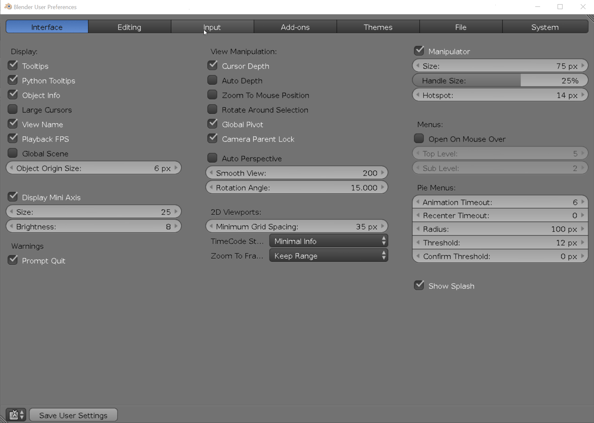 Installing addon and setting up Coordinate System|
|:---:|

[Learn more](https://github.com/domlysz/BlenderGIS/wiki/Gereferencing-management) about Georefencing management in Blender

#### Setting up coordinate system
__`GUI`__

* Find and click on GIS addon’s interface in 3D viewport’s left toolbar. In the “Geoscene” panel , click on the gear shape icon and switch to NAD83(HARN), click ok.

|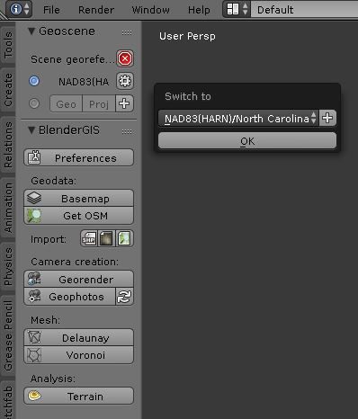 <br> Georeferencing setup in Blender GIS |
|:---:|

### III. Importing digital surface model
___________________
__`GUI`__
* Go to __file__ > __import__ > __Georeferenced Raster__
* On the bottom left side of the window find  __Mode__ and select __As DEM__
* Set __subdivision__ to *Mesh* and select *NAD83(HARN)* for georeferencing
* Browse to the 'ICC_workshop' folder and select 'example1_dsm.tif'
* Click on __Import georaster__ on the top right header
* If all the steps are followed correctly, you should be able to see the terrain in 3D view window

|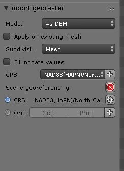 <br> Georaster import parameters|
|:---:|

__`Python editor`__
``` python
import bpy
import os
filePath = os.path.dirname(bpy.path.abspath("//"))
fileName = os.path.join(filePath,'example1_dsm.tif')
bpy.ops.importgis.georaster(filepath=fileName,
                            importMode="DEM", subdivision="mesh",
                            rastCRS="EPSG:3358")
```


#### Surface subdivision and refinement
__`GUI`__
* Select surface model (right click on the object)
* Go to __3D view__ editor's bottom toolbar > __Object interaction mode__ >  __Edit Mode__
* Switch to __Face select__
* If object is not orange in color (i.e., nothing is selected), go to __Select__ > __(De)select All__ (or press `A`) to select all faces (when the object faces are selected, they will turn orange)
* Go to __Tools__ (left toolbar) > __Mesh Tools__ > __Subdivide__ . The subdivide dialogue should appear on the bottom left on the toolbar. Type "4" in the number of cuts tab
* Go to __3D view__ editor's bottom toolbar > __Object interaction mode__ >  __Object Mode__ . You should be able to see the surface details at this point (bottom figure, right image).
<br>

__`Python editor `__
``` python
import bpy
bpy.ops.object.mode_set(mode='EDIT')
bpy.ops.mesh.select_all(action='SELECT')
bpy.ops.mesh.subdivide(number_cuts=4, smoothness=0.2)
bpy.ops.object.mode_set(mode='OBJECT')
```

| DSM surface after importing|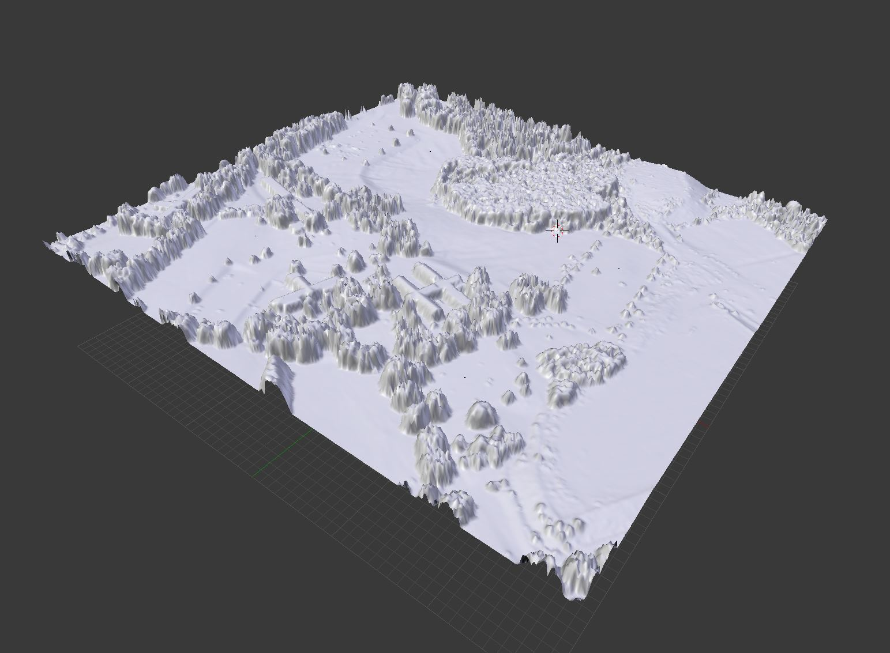 DSM surface after subdivision|
|:---:|:---:|

___________________
#### IV. Importing viewpoint shapefile

In this step we will import viewpoint locations as a point feature shapefile. The features represent the location from which the viewsheds are computed on the digital surface.

__`GUI`__
* Import viewpoint shape file
   * Go to __file__ > __import__ > __Shapefile__
   * Browse workshop data directory, select *vpoints.shp* and click on __Import Shp__ . The shape import dialogue should appear in front of the GIS addon interface.
   * Activate “Elevation from field” and in field panel select “height”
   * Activate “Separate objects”
   * Activate “Object name from field” and in field panel select “Name”, you should be able to see 4 the points on the surface and 4 objects added to the Outliner with the names *Viewshed_1, Viewshed_2,Viewshed_3, Viewshed_4*
   * Select __OK__

|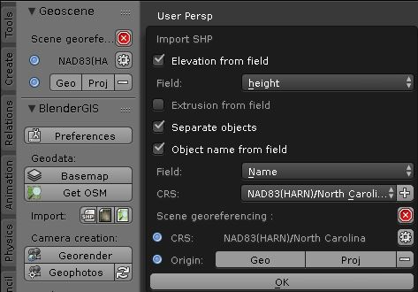 <br> Blender Gis shape import dialogue|
|:---:|

__`Python editor`__
```python
import bpy
import os
filePath = os.path.dirname(bpy.path.abspath("//"))
fileName = os.path.join(filePath,'vpoints.shp')
bpy.ops.importgis.shapefile(filepath=fileName,fieldElevName="height",fieldObjName='Name',separateObjects=True,shpCRS='EPSG:3358')
```

#### Creating viewpoint markers
Imported points are 2D vectors that cannot be rendered as they don't have actual surfaces. Now we create 4 small spheres and match their location with the imported points to visualize observer locations in 3D.

__`GUI`__
* To create spheres on the viewpoint location:
    * Go to 3D Viewport’s __bottom header__ > __Add__ > __Mesh__ > __UV sphere__. The Add UV sphere dialogue will open on the left side of the Toolbar. Set the Size parameter to 3.000
    * Select Sphere object (by clicking on it in __Outliner__) and press Shift + D or ctrl+c , ctrl+v to make a copy of the object, you should see the *Sphere.001* in the outliner
    Make 3 copies of the sphere and rename them to *Sphere1, Sphere2, ... , Sphere4*
    * From __Outliner__ select the object *Viewshed_1*
    * Go to __Properties Editor__ > __Object__ > __Transform__ > __Location__ to retrieve the viewshed point’s coordinates (X,Y,Z)
* To move each of the 4 spheres to the corresponding viewshed location:
    * Copy and paste the retrieved coordinates from Viewshed_1 into the location parameters for Sphere1
    * Add 2.0 extra units to the Z parameter (only for __Location__) to raise the spheres above the ground
    * Repeat this process for each Viewshed and each Sphere
    * You should now have 4 spheres aligned on the imported viewshed points.

|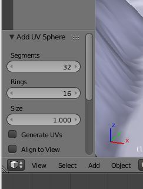 <br> UV Sphere toolbar|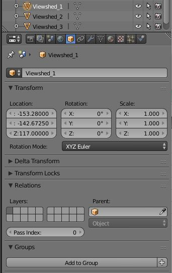 <br> Object transform panel in properties editor|
|:---:|:---:|

__`Python editor`__

```python
import bpy
# get get viewpoint objects create a sphere using their X,Y and Z+2 coordinates
for obj in bpy.data.objects:
    if "Viewshed" in obj.name:
        bpy.ops.mesh.primitive_uv_sphere_add(size=3.0, location=(obj.location[0],obj.location[1],obj.location[2]+2))
        sphere = bpy.context.active_object
        # rename the sphere
        sphere.name = "Sphere" + obj.name[-2:]
```

|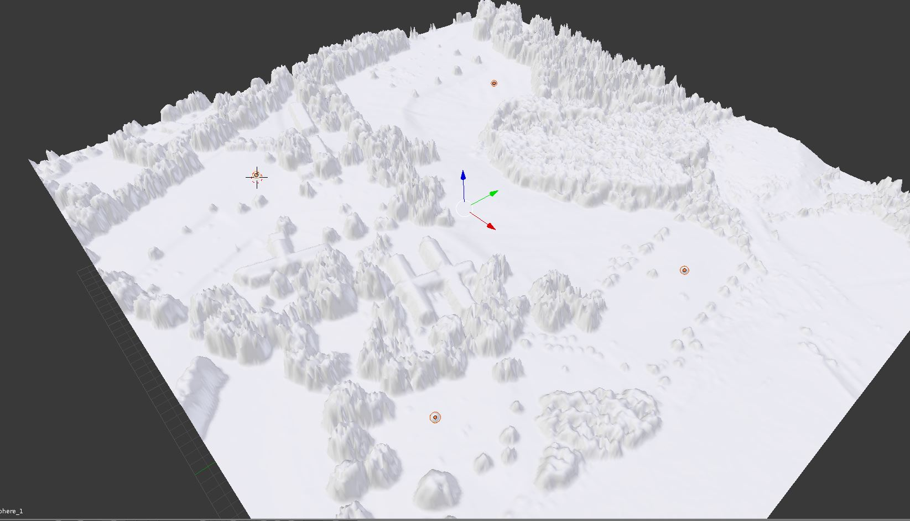 <br> 4 spheres representing observation points|
|:---:|

#### Generating 4 copies of the surface and viewpoint spheres

In this step we create 4 copies of the surface model and move each of the viewpoint spheres to the  
corresponding surface

__`GUI`__
* Select DSM object and press `Shift + D` or `ctrl+c` , `ctrl+v` to make a copy of the object , you should see the example1_dsm.001 in the outliner
* Select the "example1_dsm001"
* While holding shift key select "Sphere_1" from outline to select both DSM and corresponding Sphere
* go to __Properties Editor__ > __Object__ (cube icon)
* In the __Transform__ panel > __Location__ > __X:__ type *750* to move the duplicated surface 750 meters to the east  
* Create another copy of the DSM , put -750 for Y parameter to move the duplicate surface 750 meters to the south
* Create another copy of the DSM, put 750 for X parameter and -750 in Y parameter. The final model should look like figure


__`Python editor`__
``` python
import bpy

for ob in bpy.data.objects:
    ob.select = False
obj = bpy.data.objects["example1_dsm"]
obj.name = "example1_dsm1"
obj.select = True

# create and rename 3 replicates of DSM, and move spheres to create 4 DSMs and spheres
bpy.ops.object.duplicate_move(OBJECT_OT_duplicate={"mode":'TRANSLATION'}, TRANSFORM_OT_translate={"value":(750, 0, 0 )})
bpy.data.objects ["example1_dsm1.001"].name = "example1_dsm2"
sphere2Obj = bpy.data.objects ["Sphere_2"]
loc = sphere2Obj.location
sphere2Obj.location = (loc[0]+750, loc[1], loc[2])

bpy.ops.object.duplicate_move(OBJECT_OT_duplicate={"mode":'TRANSLATION'}, TRANSFORM_OT_translate={"value":(0, -750, 0 )})
bpy.data.objects ["example1_dsm2.001"].name = "example1_dsm3"
sphere3Obj = bpy.data.objects ["Sphere_3"]
loc = sphere3Obj.location
sphere3Obj.location = (loc[0]+750, loc[1]-750, loc[2])

bpy.ops.object.duplicate_move(OBJECT_OT_duplicate={"mode":'TRANSLATION'}, TRANSFORM_OT_translate={"value":(-750, 0, 0 )})
bpy.data.objects ["example1_dsm3.001"].name  = "example1_dsm4"
sphere4Obj = bpy.data.objects ["Sphere_4"]
loc = sphere4Obj.location
sphere4Obj.location = (loc[0],loc[1]-750, loc[2])
```

|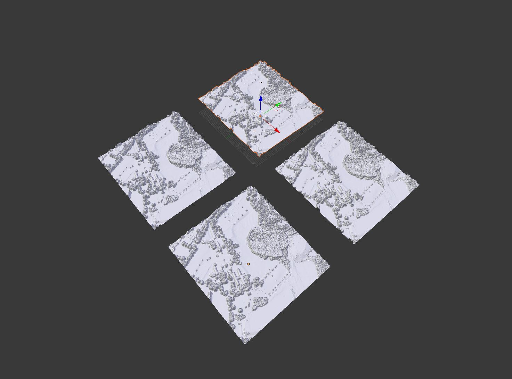 Replicated models|
|:---:|

### V. Shading the scene
Now we will create a mixed material to combine Orthophoto and viewshed maps. We will use emission shaders to show viewsheds as glowing surfaces.

__`GUI`__
* Make sure that the __Render engine__ is set to *Cycles* and 3D viewport __Shading__ is set to *Material*
* Change the bottom editor panel to __Node editor__. This can be done by simply changing the Editor Type selector (bottom left hand side of the window).
* Select the first DSM object "example_dsm1"
* Go to __Properties tab__ > __Material__  Press __+ New__ button to add material
    * Rename the Material to "Viewshed1"
    * Expand the __Surface__ panel and click on the gray square shaped icon on the right side of the __Surface__ parameter to see a popup window with texture parameters. Select __Mix Shader__ . You should be able to see two __Shaders__ added below the mix shader.
* Click on the first shader and select *Emission* from the dropdown list
    * Click on the radio button on the right side of the __color__ field  >  __texture__ >  __Image texture__
    * Click on __Open__ and load "viewshed_1_1.png". You should be able to see the viewshed draped on the DSM surface
    * Change the __Strength__ slider to 1.8 to increase the viewshed's emission power
* Click on the second shader and select *Diffuse BSDF* from the dropdown list
    * Click on the radio button on the right side of the __color__ field  >  __texture__ >  __Image texture__
    * Click on __Open__ and load "ortho.png". You should be able to see the viewshed draped on the DSM surface

Now notice how the material logic and workflow is represented in Node editor. You can play with each of the individual nodes ,the links between them and the values.
* Play with the __Fac__ slider on the __Mix shader__ node to adjust the mixture level
* Repeat the shading procedure for the other 3 objects using "Viewshed_1_2.png", "Viewshed_1_3.png", "Viewshed_1_4.png"  

|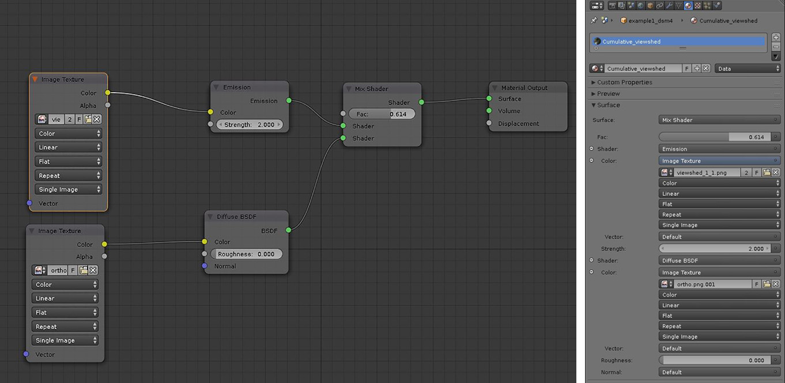 Node editor and Properties panel|
|:---:|


__`Python editor`__
``` Python
import bpy
import os
filePath = os.path.dirname(bpy.path.abspath("//"))
ortho = os.path.join(filePath, 'ortho.png')

for obj in bpy.data.objects:
    if "dsm" in obj.name :
        obj.select = True
        fileName = "viewshed_{0}_1.png".format(obj.name[-1:])
        matName = os.path.join(filePath, fileName)
# Create a new material and assign it to the DSM object # 3

        mat = (bpy.data.materials.get(matName) or
               bpy.data.materials.new(matName))

        obj.data.materials.append(mat)

        # Get material tree , nodes and links #
        mat.use_nodes = True
        node_tree = mat.node_tree
        nodes = node_tree.nodes
        links = node_tree.links
        for node in nodes:
            nodes.remove(node)
        diffuseNode = node_tree.nodes.new("ShaderNodeBsdfDiffuse")
        diffuseNode.location = (300,400)
        #diffuseNode = nodes["Diffuse BSDF"]

        # Add a new texture for viewshed #
        viewshedNode = node_tree.nodes.new("ShaderNodeTexImage")
        viewshedNode.select = True
        node_tree.nodes.active = viewshedNode
        viewshedNode.image = bpy.data.images.load(matName)
        viewshedNode.location = (100, 100)

        # Add a new texture for ortho #
        orthoNode = node_tree.nodes.new("ShaderNodeTexImage")
        orthoNode.select = True
        node_tree.nodes.active = orthoNode
        orthoNode.image = bpy.data.images.load(ortho)
        orthoNode.location = (100, 400)
        # Add a new mixshader node and link it to the diffuse color node#

        mixShaderNode = node_tree.nodes.new("ShaderNodeMixShader")
        mixShaderNode.location = (600, 250)
        mixShaderNode.inputs["Fac"].default_value = .7
        emissionNode = node_tree.nodes.new("ShaderNodeEmission")
        emissionNode.location = (300, 100)
        outputNode = node_tree.nodes.new("ShaderNodeOutputMaterial")
        outputNode.location = (800, 250)
        emissionNode.inputs[1].default_value = 2

        links.new (viewshedNode.outputs["Color"], emissionNode.inputs["Color"])
        links.new (orthoNode.outputs["Color"], diffuseNode.inputs["Color"])
        links.new (emissionNode.outputs["Emission"], mixShaderNode.inputs[2])
        links.new (diffuseNode.outputs["BSDF"], mixShaderNode.inputs[1])
        links.new (mixShaderNode.outputs["Shader"], outputNode.inputs["Surface"])

```
|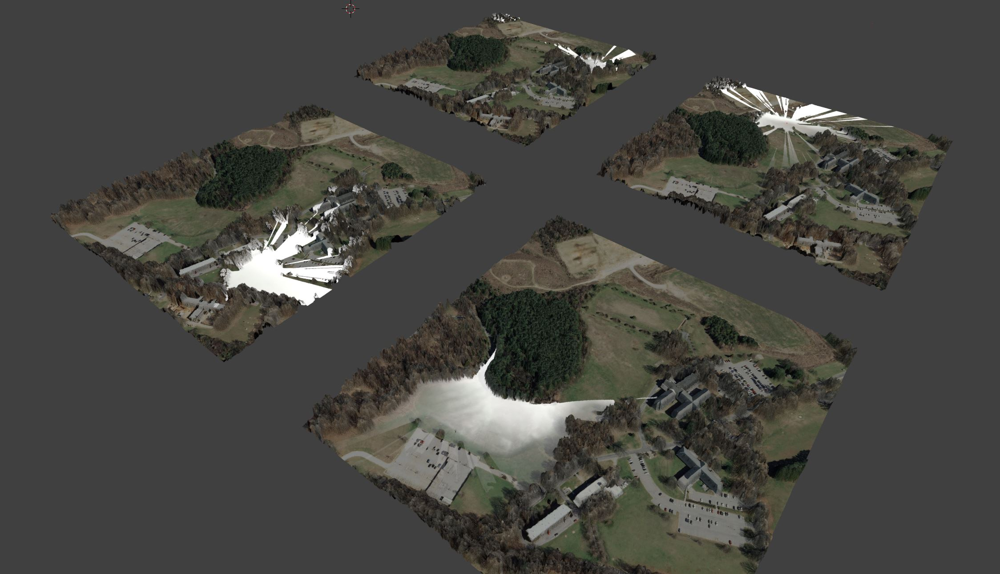 Viewshed and Orthophoto draped on DSM surface using Mix shader |
|:---:|

#### Shading Viewpoints
Now follow the same workflow to shade viewpoint spheres but this time only use diffuse node (*Diffuse BSDF*) a with solid orange color.

* Select the first sphere, create a new material using nodes
* Change the surface color to
* repeat the same for all spheres
``` python
import bpy
for obj in bpy.data.objects:
    if "Sphere" in obj.name:
        obj.select = True
        matName = "sphere"
    # Create a new material and assign it to the DSM object # 3
        mat = (bpy.data.materials.get(matName) or
               bpy.data.materials.new(matName))
        obj.data.materials.append(mat)
        # Get material tree , nodes and links #
        mat.use_nodes = True
        node_tree = mat.node_tree
        nodes = node_tree.nodes
        links = node_tree.links
        nodes[1].inputs[0].default_value = (.8, .3, 0, 1)
        obj.select = False
```
|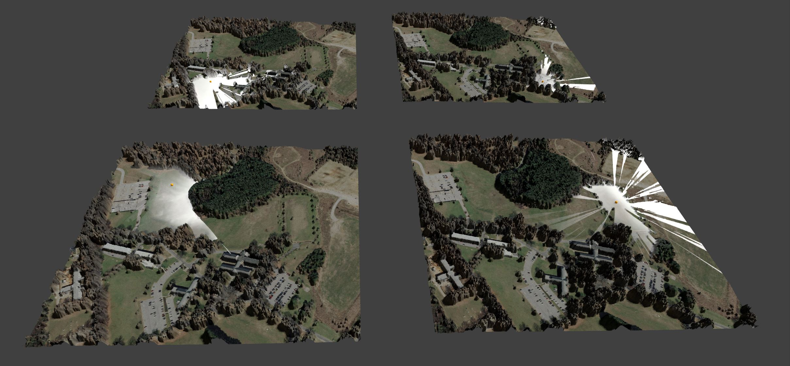 <br> Viewport render of the viewshed |
|:---:|

### VI. Modelling made easy
Now lets try to run the entire procedure with a python file using __Text editor__ and __Python console__  

* From top header goto  __file__> __New__ to Open a fresh copy of Blender
* Save the blender file with you preferred name in the workshop directory.
  __Note__: This is an important step since your all the paths in python code are linked to that directory
* In the top header find __Layout__ (right next to __help__ ) and switch the layout to *Scripting* The scripting layout includes : a __Text editor__(left), a __Python Console__ (bottom) and __3D view__ (right)
* Procedure for __Text editor__
  * In __Text editor__ > __Open__  > Go to workshop directory and find *example_a.py*
  * Click on __run script__
* Procedure for  __Python Console__
  * type the following lines in the console. Note that you need to type in the workshop path in you computer in the first line.

__`Python Console>>>`__
```python
filename = "/full/path/to/example_a.py"
exec(compile(open(filename).read(), filename, 'exec'))
```

__`Python editor`__
```python
import bpy
import os

filePath = os.path.dirname(bpy.path.abspath("//"))
dsmName = os.path.join(filePath,'example1_dsm.tif')
imgPath = os.path.join(filePath,'cumulative_viewshed.png')
vpointName = os.path.join(filePath,'vpoints.shp')
ortho = os.path.join(filePath, 'ortho.png')

# Setting up the scene
if bpy.data.objects.get("Cube"):
    cube = bpy.data.objects["Cube"]
    cube.select = True
    bpy.ops.object.delete()

# change lamp type and elevation
import bpy
lamp = bpy.data.lamps["Lamp"]
lamp.type = "SUN"
lampObj = bpy.data.objects["Lamp"]
lampObj.location[2] = 1000

# Setup node editor for lamp and increase the lamp power
lamp.use_nodes = True
lamp.node_tree.nodes["Emission"].inputs[1].default_value = 6

# Set render engine to cycles
bpy.context.scene.render.engine = 'CYCLES'
bpy.ops.importgis.georaster(filepath=dsmName,
                            importMode="DEM", subdivision="mesh",
                            rastCRS="EPSG:3358")

# Subdivision render engine to cycles
bpy.ops.object.mode_set(mode='EDIT')
bpy.ops.mesh.select_all(action='SELECT')
bpy.ops.mesh.subdivide(number_cuts=4, smoothness=0.2)
bpy.ops.object.mode_set(mode='OBJECT')

# import viewpoints
bpy.ops.importgis.shapefile(filepath=vpointName,fieldElevName="height",fieldObjName='Name',separateObjects=True,shpCRS='EPSG:3358')

# adding spheres
for obj in bpy.data.objects:
    if "Viewshed" in obj.name:
        bpy.ops.mesh.primitive_uv_sphere_add(size=3.0, location=(obj.location[0],obj.location[1],obj.location[2]+2))
        sphere = bpy.context.active_object
        # rename the sphere
        sphere.name = "Sphere" + obj.name[-2:]

for ob in bpy.data.objects:
    ob.select = False
obj = bpy.data.objects["example1_dsm"]
obj.name = "example1_dsm1"
obj.select = True

# create and rename 3 replicates of DSM, and move spheres to create 4 DSMs and spheres

bpy.ops.object.duplicate_move(OBJECT_OT_duplicate={"mode":'TRANSLATION'}, TRANSFORM_OT_translate={"value":(750, 0, 0 )})
bpy.data.objects ["example1_dsm1.001"].name = "example1_dsm2"
sphere2Obj = bpy.data.objects ["Sphere_2"]
loc = sphere2Obj.location
sphere2Obj.location = (loc[0]+750, loc[1], loc[2])

bpy.ops.object.duplicate_move(OBJECT_OT_duplicate={"mode":'TRANSLATION'}, TRANSFORM_OT_translate={"value":(0, -750, 0 )})
bpy.data.objects ["example1_dsm2.001"].name = "example1_dsm3"
sphere3Obj = bpy.data.objects ["Sphere_3"]
loc = sphere3Obj.location
sphere3Obj.location = (loc[0]+750, loc[1]-750, loc[2])

bpy.ops.object.duplicate_move(OBJECT_OT_duplicate={"mode":'TRANSLATION'}, TRANSFORM_OT_translate={"value":(-750, 0, 0 )})
bpy.data.objects ["example1_dsm3.001"].name  = "example1_dsm4"
sphere4Obj = bpy.data.objects ["Sphere_4"]
loc = sphere4Obj.location
sphere4Obj.location = (loc[0],loc[1]-750, loc[2])

# Shading Viewsheds
for obj in bpy.data.objects:
    if "dsm" in obj.name :
        obj.select = True
        fileName = "viewshed_{0}_1.png".format(obj.name[-1:])
        matName = os.path.join(filePath, fileName)
# Create a new material and assign it to the DSM object # 3

        mat = (bpy.data.materials.get(matName) or
               bpy.data.materials.new(matName))

        obj.data.materials.append(mat)

        # Get material tree , nodes and links #
        mat.use_nodes = True
        node_tree = mat.node_tree
        nodes = node_tree.nodes
        links = node_tree.links
        for node in nodes:
            nodes.remove(node)
        diffuseNode = node_tree.nodes.new("ShaderNodeBsdfDiffuse")
        diffuseNode.location = (300,400)
        #diffuseNode = nodes["Diffuse BSDF"]

        # Add a new texture for viewshed #
        viewshedNode = node_tree.nodes.new("ShaderNodeTexImage")
        viewshedNode.select = True
        node_tree.nodes.active = viewshedNode
        viewshedNode.image = bpy.data.images.load(matName)
        viewshedNode.location = (100, 100)

        # Add a new texture for ortho #
        orthoNode = node_tree.nodes.new("ShaderNodeTexImage")
        orthoNode.select = True
        node_tree.nodes.active = orthoNode
        orthoNode.image = bpy.data.images.load(ortho)
        orthoNode.location = (100, 400)
        # Add a new mixshader node and link it to the diffuse color node#

        mixShaderNode = node_tree.nodes.new("ShaderNodeMixShader")
        mixShaderNode.location = (600, 250)
        mixShaderNode.inputs["Fac"].default_value = .7
        emissionNode = node_tree.nodes.new("ShaderNodeEmission")
        emissionNode.location = (300, 100)
        outputNode = node_tree.nodes.new("ShaderNodeOutputMaterial")
        outputNode.location = (800, 250)
        emissionNode.inputs[1].default_value = 2

        links.new (viewshedNode.outputs["Color"], emissionNode.inputs["Color"])
        links.new (orthoNode.outputs["Color"], diffuseNode.inputs["Color"])
        links.new (emissionNode.outputs["Emission"], mixShaderNode.inputs[2])
        links.new (diffuseNode.outputs["BSDF"], mixShaderNode.inputs[1])
        links.new (mixShaderNode.outputs["Shader"], outputNode.inputs["Surface"])
# shading viewpoints        
for obj in bpy.data.objects:
    if "Sphere" in obj.name:
        obj.select = True
        matName = "sphere"
    # Create a new material and assign it to the DSM object # 3
        mat = (bpy.data.materials.get(matName) or
               bpy.data.materials.new(matName))
        obj.data.materials.append(mat)
        # Get material tree , nodes and links #
        mat.use_nodes = True
        node_tree = mat.node_tree
        nodes = node_tree.nodes
        links = node_tree.links
        nodes[1].inputs[0].default_value = (.8, .3, 0, 1)
        obj.select = False

# Switch to shading mode
for area in bpy.context.screen.areas:
    if area.type == 'VIEW_3D':
          for space in area.spaces:
              if space.type == 'VIEW_3D':
                  space.viewport_shade = 'MATERIAL'

```

------------

### Acknowledgment
This work is built upon great contributions and support of [Blender](https://www.blender.org/) team, Blender GIS addon developers [(domlysz/BlenderGIS)](https://github.com/domlysz/BlenderGIS) , Center for [Geospatial Analytics](https://cnr.ncsu.edu/geospatial/), NC State's [Geoforall lab](https://geospatial.ncsu.edu/osgeorel/) and [Garrett Millar](https://github.com/gcmillar).
